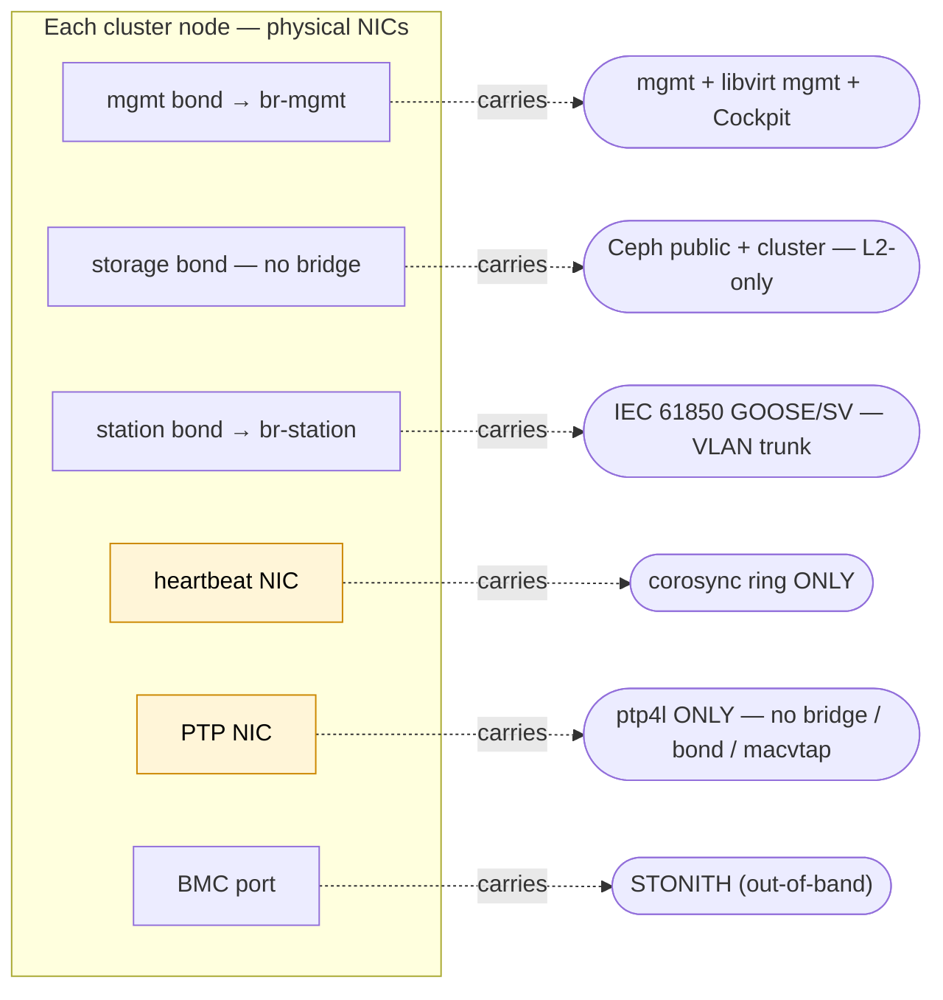
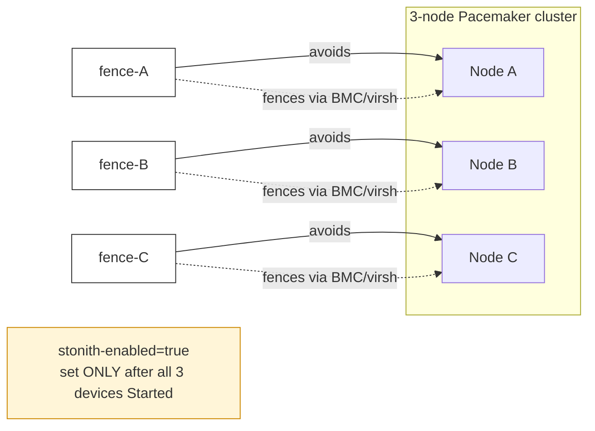
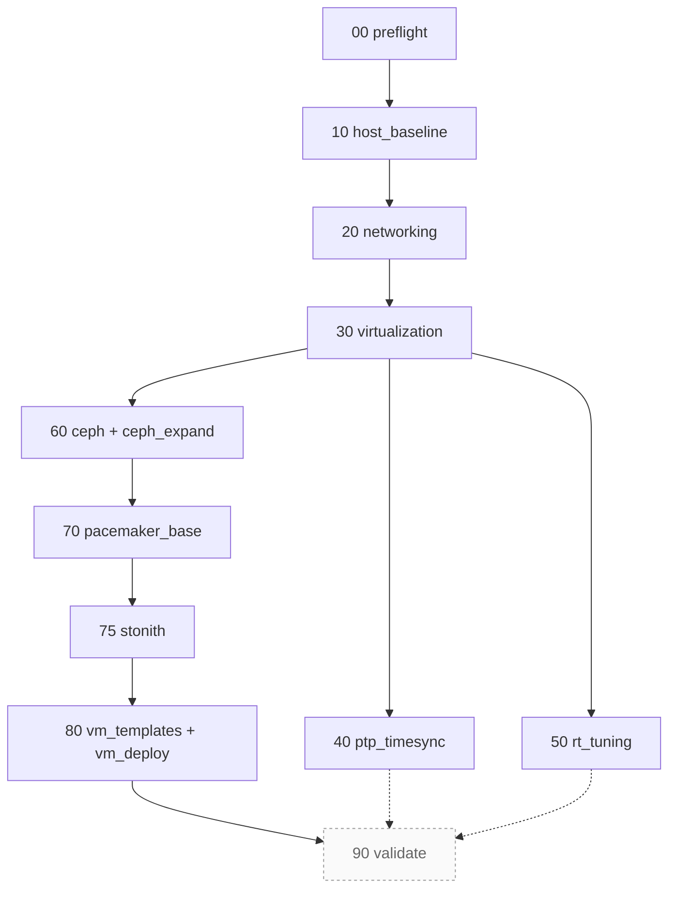

# Architecture

## What a vPAC cluster is

A Virtual Protection Architecture Cluster (vPAC) is a 3-node RHEL 9 cluster that hosts utility protection and automation workloads — IEC 61850 relays (SSC600-style), RTAC/RTU/VPR applications, and Windows engineering workstations — as virtual machines with real-time tuning and shared storage.

It replaces a rack of single-purpose hardware relay panels with a single HA platform that can host multiple vendors' protection software side-by-side, migrate workloads between nodes for maintenance, and recover from a node failure in seconds.

## Components

| Layer | Technology | Role |
|---|---|---|
| Operating system | RHEL 9 (9.7+) | Base platform, real-time tuning, kernel-rt from NFV repo |
| Hypervisor | KVM + libvirt | VM lifecycle, CPU pinning, hugepages, sanlock leases |
| Shared storage | Red Hat Ceph Storage 7 (`cephadm`) — CephFS + RBD | CephFS for VM disks; RBD pool backs the sanlock lockspace |
| Cluster manager | Pacemaker + Corosync (RHEL HA add-on) | VM placement, failover, quorum |
| Fencing | STONITH — `fence_ipmilan` (production) or `fence_virsh` (lab) | Split-brain prevention; configurable via `stonith.fence_agent` |
| Time sync | PTP (IEEE 1588 / Power Profile C37.238) via `timemaster` + RT-tuned chrony | Sub-µs sync for relays, NTP-follower fallback for hosts without a PTP NIC |
| Real-time tuning | `kernel-rt`, tuned `realtime-virtual-host`, isolcpus, 1 GiB hugepages, Intel CAT (`pqos`), `sched_rt_runtime_us=-1` | Deterministic VM latency under 120 µs |
| VM lock manager | `sanlock` over RBD (lockspace image on `rbd-vms` pool) | Belt-and-suspenders against simultaneous VM start on two nodes if Pacemaker / fencing both fail |

## Network layout

Five logical networks plus a BMC out-of-band path. Collapsing them onto fewer physical NICs is possible but some combinations are **hazardous** and the playbooks reject them:

| Network | Purpose | Typical separation |
|---|---|---|
| Management | Ansible, SSH, libvirt mgmt | Bridge `br-mgmt`, reachable from the SA's workstation |
| Storage | Ceph public + cluster | Dedicated bond, no bridge, no gateway (L2-only) |
| Station bus | IEC 61850 GOOSE/SV | Bridge `br-station`, VLAN-trunked to relays / process bus |
| Heartbeat | Corosync ring | **Dedicated NIC or VLAN**, not a bridge member — see below |
| PTP | Time sync | **Dedicated NIC**, not a bridge member — see below |
| BMC | STONITH | Usually a separate physical OOB network |

### Why heartbeat must not share the VM management bridge

On a shared `br-mgmt`, any bridge churn from guest VMs (frequent restarts, mass `vnet*` creation) causes STP flapping and packet drops. Corosync heartbeats ride on the same bridge and start timing out. Once heartbeats are lost, Pacemaker splits the cluster. In one deployment this caused two corosync partition events 20 seconds apart and a permanent pacemaker shutdown on one node, with a VM running simultaneously on two nodes against the same CephFS image.

Mitigation: corosync runs on a **dedicated network** (physical NIC or VLAN with its own bridge) that does not carry VM libvirt traffic.

### Why PTP must not share a NIC with macvtap or bridges

macvtap passthru on a NIC captures ethernet frames at the driver level. PTP event messages destined for the host can be consumed by guest VMs instead of by `ptp4l`, producing `SYNCHRONIZATION_FAULT` every few seconds.

Mitigation: PTP runs on a **dedicated NIC** that is not a bridge member, not a bond slave, not a macvtap target. The `ptp_isolation` role verifies this.

## Node roles

In the reference design all three nodes are identical peers at the cluster level (each runs MON+MGR+OSD for Ceph and is a full Pacemaker member). Workload placement differs:

- **Nodes A and B** host real-time relay VMs (SSC600-style, VPR-style). Identical hardware is recommended so VMs can migrate between them.
- **Node C** hosts the Windows engineering workstation with PCI NIC passthrough (for Wireshark on process-bus traffic). NICs used for passthrough are not attached to host bridges.

This split is configurable via the `rt_hosts` and `windows_hosts` inventory groups.

## Real-time guarantees

- Dedicated CPUs isolated from the kernel scheduler (`isolcpus=` + `nohz_full=` + `rcu_nocbs=`)
- Per-VM CPU pinning (vcpupin + emulatorpin + iothreadpin)
- 1 GB hugepages for relay VMs, locked memory, `memballoon` disabled
- FIFO priority per VM (higher for more latency-sensitive VMs)
- RT chrony settings (`lock_all`, elevated `sched_priority`, `combinelimit 0`)
- cpufreq governor `performance`
- `sched_rt_runtime_us=-1`

Target: cyclictest tail latency under 120 µs on RT hosts. Validated by the `validate` role.

## High availability

- **Quorum**: 3 nodes, simple majority. Two-node quorum-device setups are possible but not default — document at `OPERATIONS.md`.
- **Fencing**: one fence resource per node (`fence-<hostname>`), location constraint so a node can't fence itself. The agent is configurable: `fence_ipmilan` for production BMCs (iDRAC / Supermicro IPMI / generic IPMI 2.0), `fence_virsh` for libvirt-based labs that have no out-of-band BMC. `stonith-enabled=true` is set only after every fence device is registered AND has left the `Stopped` state — atomic enable, no half-armed window.
- **VM HA**: each VM is a Pacemaker `VirtualDomain` resource (managed mode, default on 3+ node clusters) with location constraints from inventory's `target_host` + `allowed_hosts`. The role lands resources `Stopped` on first deploy as a safety posture; operator runs `pcs resource enable <vm>` once disk images are confirmed present.
- **Planned reboot**: `pcs node standby` + `systemctl reboot` (or the `pcs-safe-reboot` helper installed by `pacemaker_base`). Never `pcs cluster stop` before a reboot (leaves a shutdown attribute in the CIB that blocks rejoin).
- **Sanlock-on-RBD**: belt-and-suspenders. Even if Pacemaker AND fencing both fail simultaneously, sanlock's lease on the shared RBD lockspace prevents two qemu instances from opening the same VM disk. Activated by flipping `virtualization_lock_manager: "sanlock"` after `ceph_expand` has provisioned the lockspace image.

## Storage

Ceph via `cephadm` containers. One MON+MGR per node, one MDS for CephFS, OSDs per-node from explicit device lists (no auto-discovery). CephFS is mounted at `/vms/` on all nodes; VM disk images live there, so any node can take over any VM after a fence event.

Per-node OSD device lists are declared in `group_vars/all.yml` under `ceph.osd_devices` — the playbook refuses to provision OSDs on devices that aren't empty.

## Deployment model

A single Ansible run from a control workstation:

1. Operator fills in `inventory/<site>/group_vars/all.yml` and `hosts.yml`
2. Runs `ansible-playbook -i inventory/<site> site.yml`
3. Playbook runs stages in dependency order (see below)
4. Validation stage produces a report; operator confirms targets are met

Re-running any stage via `--tags` is idempotent and safe.

### Stage flow

Solid arrows are hard dependencies; dashed are read-only verification dependencies. Stage 90 (`validate`) is currently a no-op stub that emits a debug line — every other stage is fully implemented and re-runnable.

### Operator activation steps (NOT automated by `site.yml`)

A few transitions need an operator decision and are deliberately left out of the automated flow:

| Step | Why manual |
|---|---|
| **Reboot rt_hosts** after first `rt_tuning` run | The role schedules a notify but `rt_tuning_auto_reboot: false` by default — production operators want to schedule the reboot themselves. (Set `true` for unattended labs.) |
| Flip **`virtualization_lock_manager: "sanlock"`** + re-run `--tags virt-qemu-conf` | The sanlock-on-RBD chain is dormant until the flip; default `"none"` keeps single-node labs working. Activate only after `ceph_expand` has provisioned the lockspace. |
| **`pcs resource enable <vm>`** per VM in managed mode | `vm_deploy_managed_initial_disabled: true` lands resources `Stopped` to mirror the standalone safety posture; operator enables once disk images are confirmed present. |
| **First-deploy STONITH functional test** | `playbooks/op-stonith-fence-test.yml` against a real BMC actually power-cycles the target — should only run with operator confirmation. |
