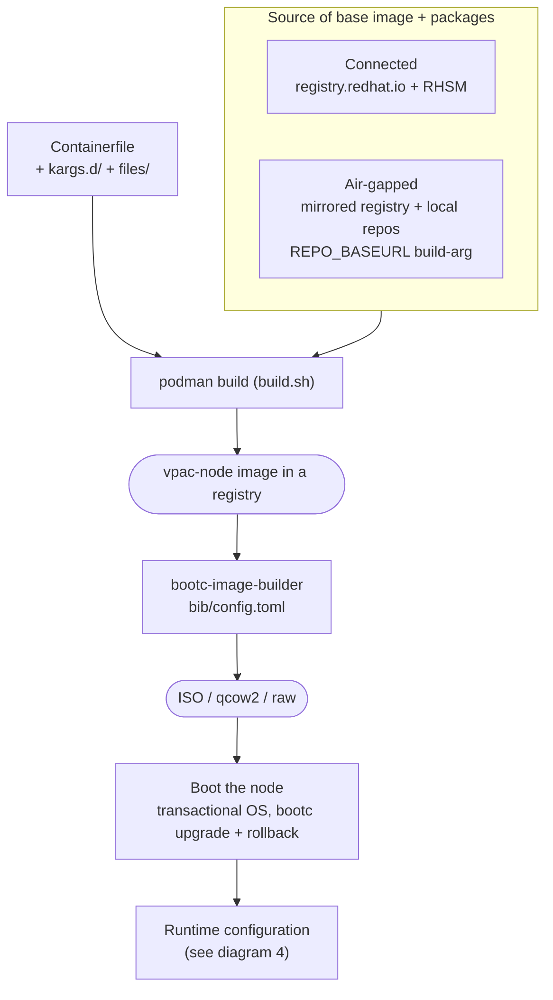
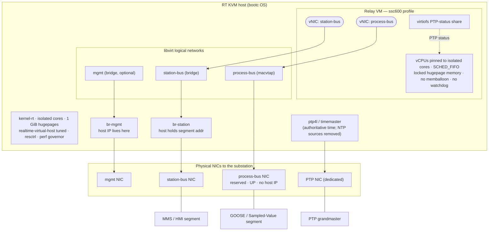
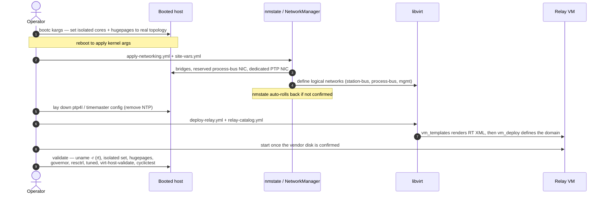
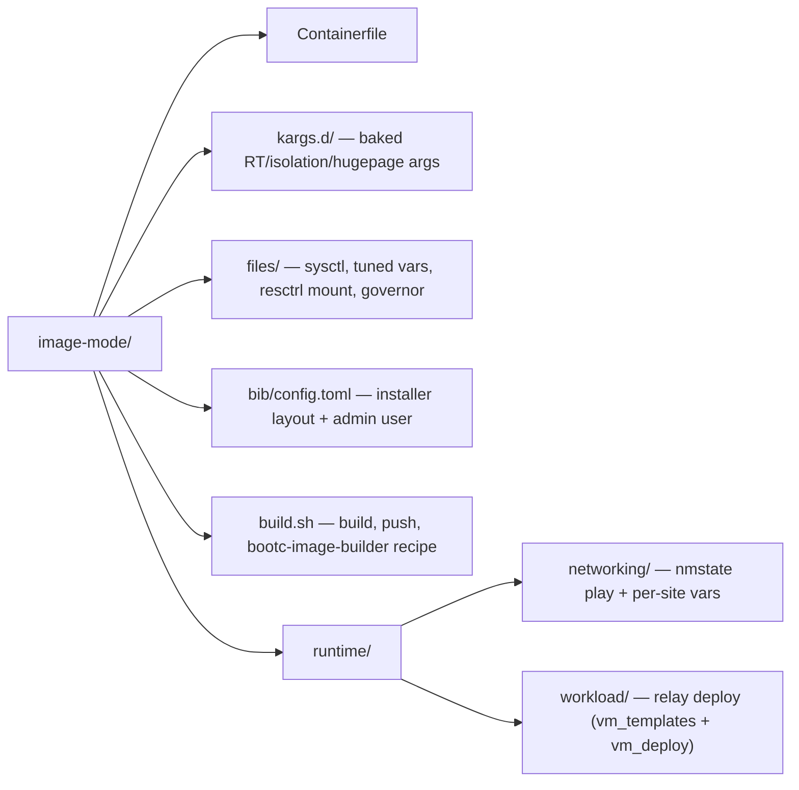

# Image-mode architecture

How the single-node vPAC host is built and deployed when the operating system is
an image-mode (bootc) container image. All diagrams render natively on GitHub.

For the prose walkthrough see [`README.md`](README.md) (image) and
[`runtime/README.md`](runtime/README.md) (per-node steps).

---

## 1. The core idea: one generic image, per-site variables

The OS image is **identical for every site**. Everything that makes a node
site-specific is applied *after boot* by Ansible from a per-site variable file.
The image carries tools and tuning; it never carries identity.

```mermaid
flowchart LR
    subgraph BUILD["Build time — baked into the image (identical everywhere)"]
        direction TB
        K["kernel-rt + RT/isolation/hugepage kargs"]
        P["KVM-host packages<br/>qemu-kvm, libvirt, virtiofsd, swtpm, OVMF"]
        T["realtime-virtual-host tuned profile<br/>resctrl mount, performance governor"]
        N["nmstate + NetworkManager (the tools only)"]
        S["linuxptp + chrony (packages + units)"]
    end

    subgraph RUN["Run time — applied per node after boot (site-specific)"]
        direction TB
        H["hostname + network identity<br/>bridges, VLANs, IPs, dedicated PTP NIC"]
        C["isolated-core indices matched to the real CPU topology"]
        PT["device-specific ptp4l / timemaster config"]
        V["the relay VM — vendor disk + libvirt domain"]
    end

    IMG(["vpac-node bootc image"])
    VARS(["per-site var file"])

    BUILD --> IMG
    IMG --> RUN
    VARS --> RUN
```

> The same image and the same pattern scale to a 3-node cluster — the variable
> set just grows (bonds, storage net, Ceph, Pacemaker). Single-node is the
> minimal end of that spectrum.

---

## 2. Build and boot pipeline

`build.sh` builds the image with `podman`, pushes it to a registry, then prints
the `bootc-image-builder` recipe that turns it into bootable media. Two paths —
connected and air-gapped — differ only in where the base image and packages come
from.

`bib/config.toml` carries the install-time admin user and filesystem layout.
After boot, OS updates are `bootc upgrade` (atomic, with rollback) instead of a
playbook re-run.

---

## 3. On-node runtime topology

What a booted, fully-configured single-node host looks like. The relay VM is
pinned to isolated cores and backed by 1 GiB hugepages; its virtual NICs attach
to libvirt **logical networks** so the domain XML never names a physical
interface. The PTP NIC is dedicated and host-only — never shared with a VM
bridge.

| Plane | Host side | What attaches |
|---|---|---|
| Management | `br-mgmt` bridge holds the host IP | optional VM mgmt NIC |
| Station bus | `br-station` bridge, host holds the segment address | relay (MMS / HMI) |
| Process bus | NIC reserved, UP, no host IP | relay via **macvtap** (GOOSE / SV) |
| PTP | dedicated NIC with `ptp4l`, host-only | nothing — never a VM bridge |

---

## 4. Runtime deploy sequence

The order a node is brought from first boot to a running, validated relay.

---

## 5. Where the pieces live

Static OS config is baked under `kargs.d/`, `files/`, and the `Containerfile`.
Everything site-specific is a variable file consumed by the plays under
`runtime/`.
