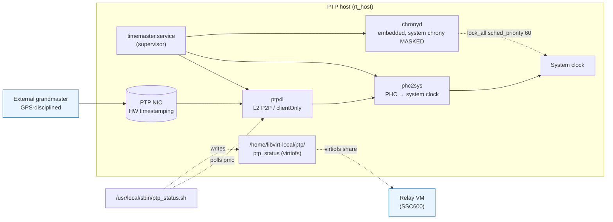

# ptp_timesync

Stage 40. Configures PTP time on every cluster host. Two execution paths
inside one role, driven by the inventory's `time_sync.mode` and whether
the host has a dedicated PTP NIC:

| `time_sync.mode` | host has PTP NIC | what runs |
|---|---|---|
| `ntp` | * | role end_hosts immediately (host_baseline already configured chrony) |
| `ptp` or `ptp_with_ntp` | yes | **PTP path** — install timemaster, mask system chronyd, render `/etc/timemaster.conf`, drop `ptp_status` writer for virtiofs share, verify GM stability |
| `ptp` or `ptp_with_ntp` | no | **NTP-follower path** — keep system chronyd, prefer the PTP-having peers in `/etc/chrony.conf` so this host follows the cluster's PTP fabric one hop away |

`ptp_with_ntp` adds the inventory's `time_sync.ntp_servers` as `[ntp_server X]`
sections inside `timemaster.conf` so the embedded chronyd has an NTP fallback
when PTP fails. `ptp` mode has no such fallback — chrony's `combinelimit 0`
means PTP wins exclusively while healthy, and on PTP loss chrony is left with
nothing (use `ptp_with_ntp` if that's not acceptable).

## Why timemaster (not bare ptp4l + chronyd)

Two daemons fighting for the system clock is a documented field incident.
`timemaster` (from `linuxptp`) is a single supervisor that spawns ptp4l,
phc2sys, and chronyd with a coordinated config — the only safe pattern when
chrony also needs the same PHC.

The role stops + masks the system `chronyd.service` on PTP hosts so it can't
be re-enabled accidentally; on NTP-follower hosts the system chronyd stays
in charge.

The NTP-follower path is simpler: system `chronyd` stays in charge, with a `blockinfile` on `/etc/chrony.conf` adding `prefer` server lines pointing at every PTP-having peer's `storage_ip`. The follower rides the PTP fabric one hop away.

## What it does (PTP path, in order)

1. **Re-run ptp_isolation** — defense-in-depth: re-asserts the PTP NIC is
   not in a bridge/bond and has no macvtap children, in case anything
   changed since stage 20.
2. **Probe `ethtool -T <ptp_nic>`** — assert PHC index present + hardware-
   transmit/receive timestamping. Fail unless `ptp_timesync_require_hw_timestamping=false`.
3. **Render `/etc/timemaster.conf`** — Power Profile P2P over L2 by default
   (`time_sync.ptp.{transport,delay_mechanism}` overrides). Damping knobs
   `announceReceiptTimeout 5` + `maxStepsRemoved 3` to handle multi-GM BMCA
   without flapping. Embedded chrony block carries the RT relay-host
   tuning (`lock_all`, `sched_priority 60`, `combinelimit 0`).
4. **Stop + mask `chronyd.service`** — timemaster owns chrony from here.
5. **Enable + start `timemaster.service`**.
6. **Drop `ptp_status.sh` + `ptp_status.service`** — polls `pmc` once a
   second and writes `PARENT_DATA_SET / PORT_DATA_SET / TIME_STATUS_NP`
   into `/home/libvirt-local/ptp/ptp_status` for virtiofs share into
   relay VMs. Lets in-VM watchdogs read host PTP health without owning a NIC.
7. **Verify** — `timemaster.service` active, system chronyd masked, ptp4l
   socket present, then 4 samples of `pmc GET PARENT_DATA_SET` 8s apart
   asserting the grandmasterIdentity is constant. Catches BMCA flap when
   multiple grandmasters are reachable on the same domain.

## What it does (NTP-follower path)

1. **`blockinfile` into `/etc/chrony.conf`** — adds `server <peer-storage-ip>
   iburst prefer minpoll 4 maxpoll 6` for every PTP-having peer in
   `vpac_cluster`. Notify chronyd restart.

The follower keeps the inventory's `time_sync.ntp_servers` (templated by
host_baseline) and just adds the prefer-PTP-peers block on top.

## Variables (with defaults)

Almost everything reads from the inventory's `time_sync.*` and
`networking_defaults.*`. Role-internal overrides:

| Name | Default | Notes |
|---|---|---|
| `ptp_timesync_role` | auto: `ptp` if NIC, else `ntp_follower` | force in host_vars to override |
| `ptp_timesync_require_hw_timestamping` | `true` | flip false to deploy on sw-only NICs (lab) |
| `ptp_timesync_ptp4l.{...}` | see `defaults/main.yml` | per-knob ptp4l overrides |
| `ptp_timesync_chrony.{...}` | reads from `rt_chrony.*` | embedded chrony settings |
| `ptp_timesync_status_dir` | `/home/libvirt-local/ptp` | virtiofs share root |
| `ptp_timesync_procbus_phc_nics` | `[]` (reads `time_sync.ptp.procbus_phc_nics`) | process-bus NICs whose PHC is disciplined from the PTP NIC's PHC (one phc2sys instance each) |
| `ptp_timesync_gm_samples` | `4` | GM-stability samples |
| `ptp_timesync_gm_sample_interval` | `8` | seconds between samples (~30s window) |

Reads from `group_vars/all.yml`: `time_sync.{mode, ntp_servers, ptp.*}`,
`rt_chrony.{lock_all, sched_priority, combinelimit}`,
`networking_defaults.ptp_nic`, `vpac_nodes[*].{hostname, storage_ip}`.

## Coordination with other roles

- **host_baseline (stage 10)** owns the bootstrap chrony config + the
  `time_sync.ntp_servers` list. The PTP path stops + masks system chronyd
  here; NTP-follower path keeps it.
- **networking (stage 20)** brings up the PTP NIC and runs `ptp_isolation`
  at its tail. This role re-runs those checks before arming ptp4l.
- **rt_tuning (stage 50)** owns the kernel-rt + RT cmdline. Its
  `rt_chrony` blockinfile on `/etc/chrony.conf` is harmless on PTP hosts
  (timemaster reads `/etc/timemaster.conf` directly, not chrony.conf), and
  effective on NTP-follower hosts that keep system chronyd.
- **vm_templates (stage 80)** can reference `ptp_timesync_status_dir`
  in a virtiofs filesystem block when a VM needs to read host PTP status.

## Tags

- `ptp` — full role
- `ptp-install` — package install only
- `ptp-check` — HW timestamping + isolation re-check
- `ptp-config`, `ptp-services` — `/etc/timemaster.conf` + service flips
- `ptp-status` — ptp_status writer
- `ptp-follower` — NTP-follower path
- `ptp-verify` — tail-end verification + GM stability sampling

## Handlers

- `restart timemaster` — fires on `timemaster.conf` change
- `restart ptp_status` — fires on script or unit change
- `restart chronyd` — fires only on the NTP-follower path's blockinfile change
